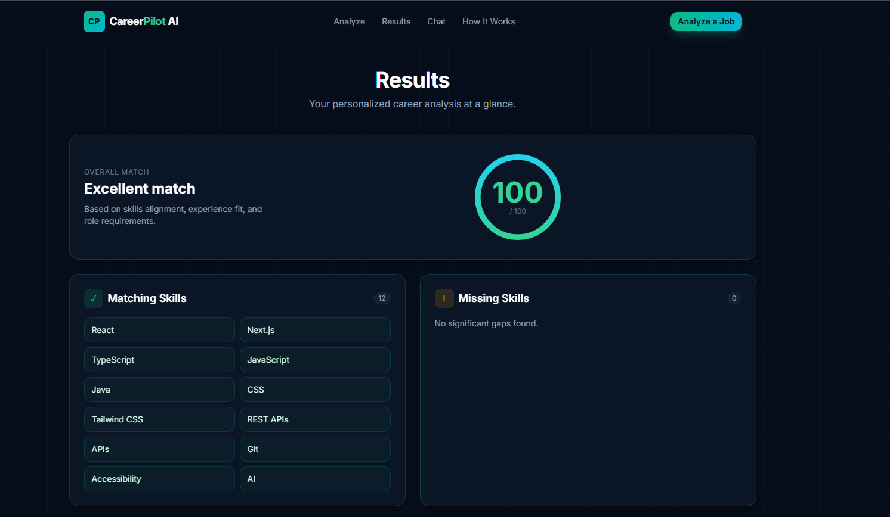

# CareerPilot AI

> **Turn a job description into a personalized career action plan.**

CareerPilot AI is a modern, AI-powered career analysis platform built for developers and job seekers. It analyzes a target job against a candidate's **skills and experience**, identifies skill gaps, produces practical recommendations, generates interview questions, and provides an AI career coach for follow-up guidance.



---

## ✦ Why CareerPilot?

Job descriptions often contain dozens of requirements, making it difficult to quickly answer:

- Am I actually a good match for this role?
- Which skills do I already have?
- What important skills am I missing?
- What should I improve before applying?
- What could the interviewer ask me?

CareerPilot turns those questions into one focused workflow:

**Job → Analyze → Understand the Gap → Improve → Prepare**

---

## 🚀 Core Features

### 01 — Intelligent Job Matching
Analyze a job description against the candidate's skills and experience and receive an overall match score.

### 02 — Skill Gap Detection
Separates the profile into:
- Matching skills
- Missing skills
- Relevant job requirements

### 03 — Actionable Recommendations
Generates practical improvement suggestions instead of generic career advice.

### 04 — Professional Summary
Creates a concise, role-focused summary explaining suitability and areas to strengthen.

### 05 — Interview Preparation
Generates targeted interview questions based on the analyzed role.

### 06 — AI Career Chat
A dedicated career coach for follow-up questions about interviews, resumes, skills, and career development.

### 07 — Robust UX States
Handles empty input, invalid input, loading, successful analysis, AI errors/unavailability, and chat errors.

---

## 🧠 How It Works

```text
Job Description + Candidate Skills + Experience
                    │
                    ▼
              AI Analysis
                    │
          ┌─────────┴─────────┐
          ▼                   ▼
     Match Score          Skill Gaps
          │                   │
          └─────────┬─────────┘
                    ▼
       Recommendations + Summary
                    │
                    ▼
           Interview Questions
                    │
                    ▼
             AI Career Chat
```

---

## 🛠️ Tech Stack

| Technology | Purpose |
|---|---|
| **Next.js** | Full-stack React application |
| **React** | Interactive UI |
| **TypeScript** | Type-safe development |
| **Tailwind CSS** | Responsive styling |
| **Local AI Model** | AI analysis and career chat |
| **Vitest** | Automated testing |
| **Git / GitHub** | Version control |
| **Vercel** | Deployment |

---

## 📁 Project Structure

```text
careerpilot-ai/
├── app/
│   ├── api/
│   └── ...
├── components/
├── lib/
│   ├── ai.ts
│   ├── types.ts
│   └── validation.ts
├── public/
├── __tests__/
│   ├── utils.test.ts
│   └── validation.test.ts
├── .env.example
├── AGENTS.md
├── CLAUDE.md
├── package.json
├── tsconfig.json
├── vitest.config.ts
└── README.md
```

---

## ⚡ Getting Started

### 1. Clone the repository

```bash
git clone YOUR_GITHUB_REPOSITORY_URL
cd careerpilot-ai
```

### 2. Install dependencies

```bash
npm install
```

### 3. Start development

```bash
npm run dev
```

Open `http://localhost:3000`.

---

## 🧪 Testing

Run the automated test suite:

```bash
npm test
```

Current test result:

```text
Test Files: 2 passed
Tests:      14 passed
```

Create a production build:

```bash
npm run build
```

---

## ♿ Accessibility

The interface is designed with accessibility in mind:

- Keyboard-accessible controls
- Clear form labels
- Readable contrast
- Visible validation and error states
- Responsive layouts
- Semantic interactive elements

---

## 🔐 Security

Sensitive credentials must never be committed to GitHub.

Use `.env.local` for local-only secrets when required.

Keep secrets out of:
- README files
- GitHub repositories
- Client-side code
- Screenshots

The current local-AI implementation does not require an OpenAI API key.

---

## 🎯 Design Philosophy

> **AI should reduce decision-making friction, not add another layer of complexity.**

CareerPilot follows:

**Clarity → Analysis → Action**

The product focuses on useful career decisions instead of overwhelming users with unnecessary AI output.

---

## 📌 Capstone Focus

CareerPilot demonstrates practical experience with:

- AI-assisted development
- Modern frontend architecture
- React / Next.js
- TypeScript
- Responsive UI design
- Form validation
- Error-state handling
- AI-powered structured analysis
- Conversational career assistance
- Automated testing
- Production build workflows

This is designed as a **complete product experience**, not simply an AI chatbot.

---

## 🔮 Future Improvements

- Resume upload and parsing
- Job URL import
- Multiple-job comparison
- Personalized learning roadmap
- Interview answer evaluation
- Resume-to-job matching
- Saved analysis history
- Exportable career reports
- Authentication and user profiles

---

## 👩‍💻 Author

**Nimra Shehzadi**

Computer Science Student | Frontend & AI Development

**FlyRank Frontend AI Engineering — Capstone Project**

---

## ⭐ Project Vision

> **Don't just apply for the job. Understand the job, understand your gap, and prepare for it.**
